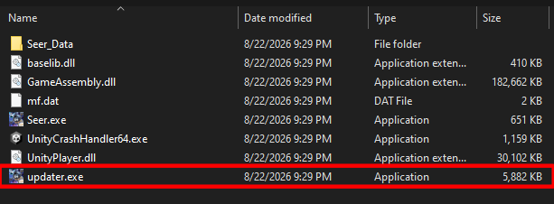
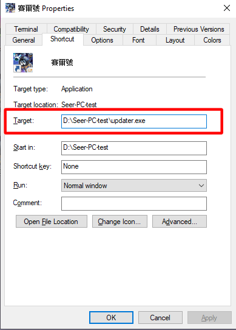

# 賽爾號更新器

一個讓你不用打開賽爾號啟動器又可以檢查賽爾號更新的更新器

還有添加了 Discord 正在遊玩的功能！

## 如何下載？

[按此下載最新版本的更新器](https://github.com/blusewill/seer-pc-updater/releases/latest/download/updater.exe)

## 如何安裝？

將下載下來的更新器 **updater.exe** 放在遊戲的安裝資料夾

**如果是透過啟動器安裝賽爾號，請放在 (起動器安裝路徑)\\Games\\NewSeer\\**

之後將捷徑路徑更改到 updater.exe 即可使用！

**如果是透過啟動器安裝，請幫我將下面的開始位置改成 (起動器安裝路徑)\\Games\\NewSeer\\**

